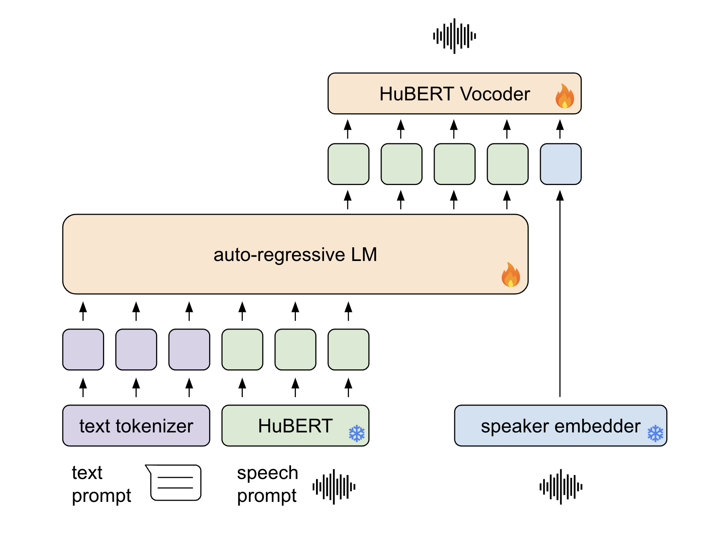

## LoTHM - Enhancing TTS Stability in Hebrew using Discrete Semantic Units


<!-- Inference code and model weights for our model LoTHM.  -->

<p align="center">
   <a href='https://arxiv.org/pdf/2410.21502'></a>
   <a href='https://pages.cs.huji.ac.il/adiyoss-lab/LoTHM/'></a> 
   <a href='https://colab.research.google.com/drive/1nTYKgku8oGfPrHLOD2NifYqpR4EYC7_O?usp=sharing'></a> 
   <a href='https://github.com/ellazeldes/LoTHM'></a> 

</p>



___
<!-- **Abstract:** We tackle the task of text-to-speech (TTS) in Hebrew. Traditional Hebrew contains Diacritics (`Niqqud'),
 which dictate the way individuals should pronounce given words, however, modern Hebrew rarely uses them. The lack of
 diacritics in modern Hebrew results in readers expected to conclude the correct pronunciation and understand which
 phonemes to use based on the context. This imposes a fundamental challenge on TTS systems to accurately map between
 text-to-speech. In this study, we propose to adopt a language modeling Diacritics-Free TTS approach, for the task of
 Hebrew TTS. The language model (LM) operates on discrete speech representations and is conditioned on a word-piece
 tokenizer. We optimize the proposed method using in-the-wild weakly supervised recordings and compare it to several
 diacritic based Hebrew TTS systems. Results suggest the proposed method is superior to the evaluated baselines
 considering both content preservation and naturalness of the generated speech. -->

<!-- ## Try it out!
You can try our model in the [google colab](https://colab.research.google.com/drive/1f3-6Dqbna9_hI5C9V4qTIG05dixW-r72?usp=sharing) demo. -->
### Installation


```bash
git clone https://github.com/ellazeldes/LoTHM
```

We publish our checkpoint
in [google drive](https://drive.google.com/drive/folders/1obshsRv7blb-3boef9o2mh6q4ROrEol3?usp=drive_link).
AR Language model trained to produce Hubert tokens from text and a Hifi-GAN based decoder to produce wav files. 

```bash
pip install uv
uv sync
# Install textless
git clone https://github.com/facebookresearch/textlesslib && cd textlesslib && git checkout ba33d6 
mv textless ../.venv/lib/python3.9/site-packages/ && cd ../
# Download models
uv run gdown --folder 1obshsRv7blb-3boef9o2mh6q4ROrEol3
```

## Inference

You can play with the model with different speakers and text prompts.

run `infer.py`:

```
export TORCH_FORCE_NO_WEIGHTS_ONLY_LOAD=1
uv run lothm/infer.py  --lm-checkpoint hebrew_models/hebrew_lm.pt \
  --vocoder-checkpoint hebrew_models/heb_decoder.pt \
  --output-dir ./out --text "אני חושב שאחת הסיבות שאני לוקח את זה נורא נורא קשה" \
  --audio-prompts sample_speaker.wav \
  --text-prompts "חוץ מזה, העלאה של הריבית יכולה להשפיע על שוק ההון מה שישפיע על הפנסיה שלכם."
```

## CSV

You can create multiple samples with csv, see [examples.csv](example.csv)

```console
uv run lothm/infer.py \
  --lm-checkpoint hebrew_models/hebrew_lm.pt \
  --vocoder-checkpoint hebrew_models/heb_decoder.pt \
  --output-dir ./out --csv_path ./example.csv
```


### Text

you can concatenate text lines using `|` or specify a path of a text file spereated by `\n` if writing Hebrew in
terminal is inconvenient.

```text
כל מה שאתם צריכים לעשות כדי לזכות	
לשנות גם על ידי אפליקציות שלנו וגם על ידי לעזור למפתחים
אז אני חושב שזה צירוף של כמה דברים	

```

and run

```
uv run python infer.py \
  --lm-checkpoint checkpoint1.pt \
  --vocoder-checkpoint checkpoint2.pt \
  --output-dir ./out \
  --text senteces.txt \
  --audio-prompts sample_speaker.wav \
  --text-prompts "חוץ מזה, העלאה של הריבית יכולה להשפיע על שוק ההון מה שישפיע על הפנסיה שלכם."
```
<!-- 

## Citation

```bibtex
@article{roth2024language,
  title={A Language Modeling Approach to Diacritic-Free Hebrew TTS},
  author={Roth, Amit and Turetzky, Arnon and Adi, Yossi},
  journal={arXiv preprint arXiv:2407.12206},
  year={2024}
}
``` -->

## Acknowledgments
- Model code is based on the implementation of [Feiteng Li](https://github.com/lifeiteng/vall-e) and [Fairseq's Expresso](https://github.com/facebookresearch/speech-resynthesis/tree/main/examples/expresso)
